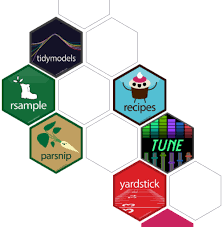

```{r setup, include=FALSE}
options(htmltools.dir.version = FALSE)
require(knitr)
# Set so that long lines in R will be wrapped:
opts_chunk$set(tidy.opts=list(width.cutoff=50),tidy=TRUE)
```

# Tidymodels


The tidymodels framework is a collection of packages for modeling and machine learning using tidyverse principles.

[https://www.tidymodels.org/](https://www.tidymodels.org/)




---

# The data


The data that we will use comes from the [`palmerpenguins` R package](https://allisonhorst.github.io/palmerpenguins/) by [Kristen Gorman](https://www.uaf.edu/cfos/people/faculty/detail/kristen-gorman.php), [Allison Horst](https://twitter.com/allison_horst), and [Alison Hill](https://twitter.com/apreshill).

---

# Import data

```{r message=FALSE}
library(readr)

#penguins_raw <- read_csv('https://raw.githubusercontent.com/rfordatascience/tidytuesday/master/data/2020/2020-07-28/penguins.csv')

penguins_raw <- read_csv("data/penguins.csv")
penguins_raw
```


---
# Exploratory Data Analysis

Dataset discovery
A first look to our data:

The dataset is composed by 344 observations (penguins) described by eight variables each. The varibales are presented previously in the table penguins.csv

penguins %>% 
    head()

---

# References

 * Tidymodels offcial website [https://www.tidymodels.org/](https://www.tidymodels.org/)
